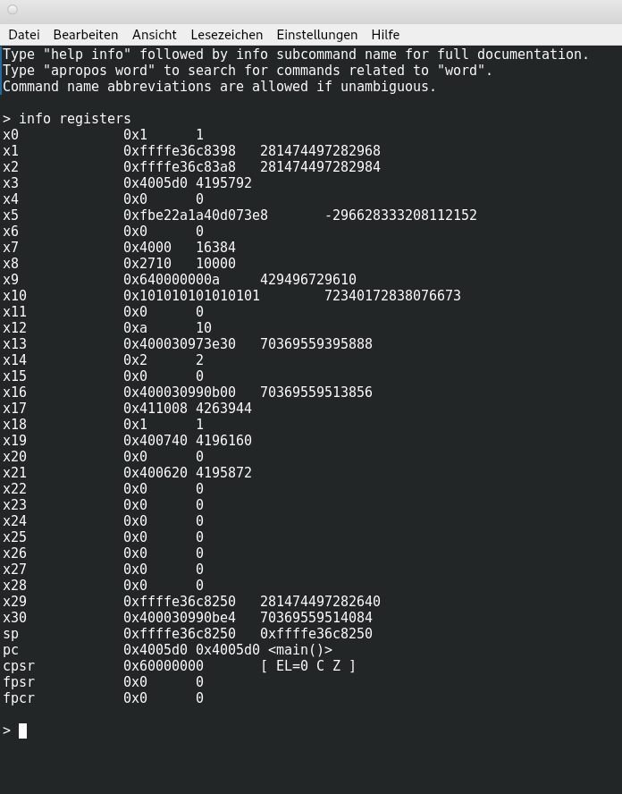

# Serie 5

## Aufgabenstellung:

## A New World

1. Choose one or two assembly examples from the lectures. For these examples, follow the lectures to perform the following steps:

    - Use the assembler to generate machine code.

    - Run and test your obtained machine code by writing C/C++ drivers.

    - Create hex-dumps of the assembled code.

    - Use the disassembler.

    Disassembly of section .text:

    0000000000000000 <load_store_2>:  
        0:   a9400c02        ldp     x2, x3, [x0]  
        4:   a9000c22        stp     x2, x3, [x1]  
        8:   d65f03c0        ret  

    - Modify the code to illustrate and test the following two concepts:

        - Aliases are syntactic sugar, we can replace them with the underlying instructions. Of course, this implies that you chose an example with an alias.

        - Instead of mnemonics one can also write machine code directly.

Output for CMP and SUBS instructions

    Disassembly of section .text:

0000000000000000 <load_store_2>:
   0:   a9400c02        ldp     x2, x3, [x0]
   4:   a9000c22        stp     x2, x3, [x1]
   8:   eb03005f        cmp     x2, x3
   c:   eb03005f        cmp     x2, x3
  10:   d65f03c0        ret

TODO: Write machine code directly!
    

As an example, we look at the instructions CMP and SUBS, where
CMP is an alias of SUBS.

## GDB and Valgrind

1. Explain the assembly code. When executing the function-call load_asm( l_a+2 ) in the driver, what are the contents of registers X1-X5 before returning in line 10?

-> see load.s and driver.cpp

2. Compile and execute the code, use -g as compile-flag. Now, run the code through GDB:
    - Set a break-point when entering the function load_asm: break load_asm.

    - Show the contents of the registers: info registers.

    

    - Now step through the load instructions by using step and show the registers’ contents after every step.

    TODO register images

3. Why are lines 18, 21, and 24 in the driver troublesome? Run the uncommented troublemakers through Valgrind and explain the output!

## Copying Data

1. Implement the function copy_asm in assembly language. Use the filename copy.s for your implementation.

2. Write “similar” code in C. Use the function-name copy_c and filename copy.c.

3. Compare your implementation to the one generated by the compiler. For the comparison, try two approaches:
    - Instruct the compiler to generate assembly code using the -S flag.

    - Compile the code and use the disassembler to generate respective assembly code.

## A Mini Matrix Kernel

1. The multiply-add instruction (MADD) performs a scalar multiplication and addition on general purpose registers. Look it up and try it out!

2. Implement the gemm_asm_gp kernel above! In your implementation completely unroll the kernel, i.e., write every instruction explicitly. There’s no need to write any loops or similar. You may implement the entire kernel by using the template above and by adding loads (ldr or ldp), multiply-adds (madd) and stores (str or stp).

3. Embed your implementation in a driver and ensure its correctness!

