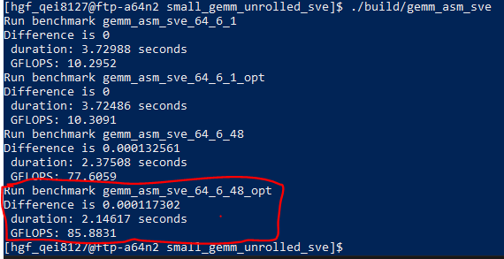

# Serie 6

## Aufgabenstellung:

### SVE: Getting Started

- Browse over the Hot Chips 28 presentation ARMv8-A Next-Generation Vector Architecture for HPC.
  
    Website under Maintenance

- Check out the presentation Introduction to ARM SVE by ARM Software Developers.

    SVE key features:  

    Vector Agnostic design -> portability of compiled code between different HW vector length implementations  
    gather-load & scatter-store  
    per-lane-predication  
    predicate-driven loop control  
    vector partitioning & software-managed speculation  
    FP horizontal reductions  

- Have a look at the paper The ARM Scalable Vector Extension.

- Have a look at the SVE entry point on the official homepages.

- Browse through the Arm Architecture Reference Manual Supplement, The Scalable Vector Extension.

- Browse through the SVE part of the ISA.

- Browse through the SVE Programming Examples Whitepaper.

- Have a look at the SVE examples of the Arm SVE Tools Tutorial.

- Read about the V1 and N2 microarchitectures, e.g, on AnandTech or The Next Platform.

- Search for additional information on SVE and its superset SVE2.

### Small GEMMs: Unrolled Part

Rules:

- Respect the procedure call standard. But: if you don’t modify a register, you don’t have to save it to the stack.

- Verify your kernels.

- Instrument your kernels for at least 1 second in your performance measurements through repeated executions.

1. Implement and verify the unrolled matrix kernel C += AB for M=64, N=6, K=1, ldA=64, ldB=1, ldC=64.

2. Tune your kernel to squeeze more performance out of the core. You may change everything, e.g., the type of the used instructions or the order of the used instructions but have to follow the rules above. Report and document your optimizations.
   
Optimizations are done in kernel gemm_asm_sve_64_6_48_opt.s.
The optimization strategies included Instruction Reordering and using immediate offsets instead of address incrementing where possible.
Instruction reordering was the most effective approach, resulting in a gain of ~5-7 GFLOPS . Using immediate offsets resulted little gain
of around 1 GFLOPS. Removing the overhead of storing / loading callee-saved register values did not lead to any significant performance
increase.

1. Add a loop over K to realize C += AB for M=64, N=6, K=48, ldA=64, ldB=48, ldC=64.

2. Come up with a creative team name and submit it together with your entries for “time (s)”, “#executions”, “GFLOPS” and “%peak” in the table above.

#### Benchmark results screenshot:

#### gemm_asm_sve_64_6_1:

| Team name   | time (s)  | #Executions   | GFLOPS  | %PEAK | 
| ----------- | --------- | ------------  | ------- | ----- |  
| HPC-Lovers  | 3.72988   | 50000000      | 10.2952 | 8,94  |  

#### gemm_asm_sve_64_6_48_opt:

| Team name   | time (s)  | #Executions   | GFLOPS  | %PEAK |   
| ----------- | --------- | ------------  | ------- | ----- |    
| HPC-Lovers  | 2.16746   | 5000000       | 85.8831 | 74,55 | 

